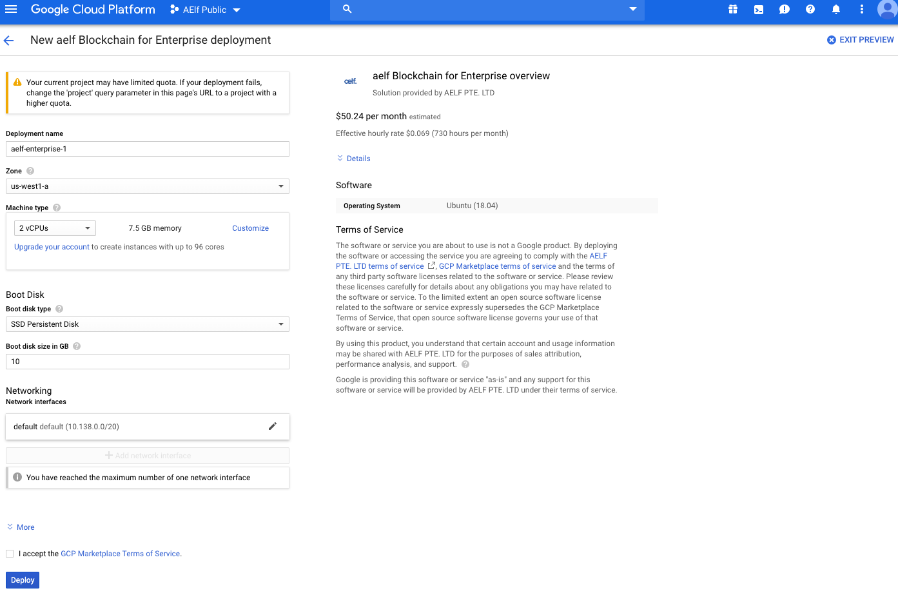
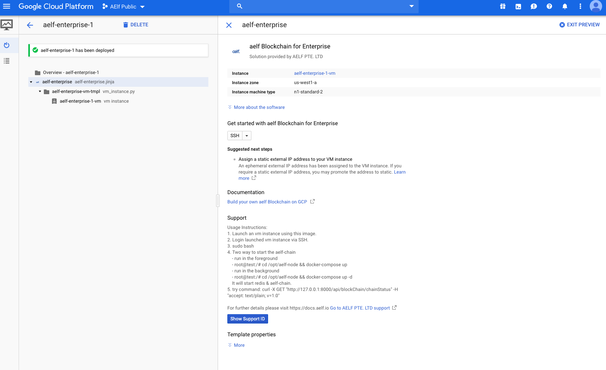
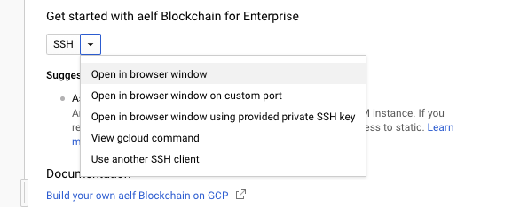
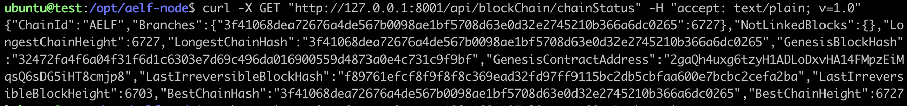

# Getting Started with Google Cloud

This guide will walk you through the steps required to run an aelf node on Google Cloud Platform (GCP).

## Step 1: Launch aelf Image

1. Go to the [Google Cloud Marketplace](https://console.cloud.google.com/marketplace) and search for "aelf blockchain for enterprise".

   

2. Find the aelf image and click on "LAUNCH ON COMPUTE ENGINE".

   

3. Keep the default settings and click "DEPLOY" at the bottom left of the page.

   

## Step 2: Access and Start the Chain

1. Login to the launched VM instance via SSH. You can do this by clicking the SSH drop-down and selecting "Open in browser window".

   

2. In the SSH session, execute `sudo bash` to elevate your privileges.

3. Start the chain with one of the following commands:

   - Run it in the foreground:
     ```bash
     cd /opt/aelf-node && docker-compose up
     ```
   - Or run it in the background:
     ```bash
     cd /opt/aelf-node && docker-compose up -d
     ```

   

## Step 3: Verify Chain Status

1. To verify that the node is working, use the following command to send an HTTP request and get the current chain status:

   ```bash
   curl -X GET "http://127.0.0.1:8001/api/blockChain/chainStatus" -H "accept: text/plain; v=1.0"
   ```

   

2. If everything is working normally, you should see the chain status increase with each request.
