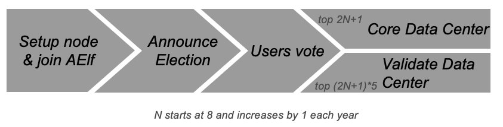

# Consensus

## Overview
Consensus is crucial for blockchains as it decides which transactions are included in the block and their order. aelf's block formation mechanism is more complex than Bitcoin and Ethereum due to its need to record Side Chain data and its cloud-based service design. Miners must update info from multiple parallel Chains. aelf uses AEDPoS consensus for high-frequency and predictable block formation.

In aelf, the consensus protocol has two parts: election and scheduling. Election decides who produces blocks, and scheduling decides when.

## Core Data Center
Core Data Centers, also known as Miners or Block Producers, act like parliament members in the aelf blockchain. aelf has 2N+1 Core Data Centers, starting with 8 and increasing by 1 each year. These nodes enforce aelf’s consensus rules, relay transactions, confirm transactions, package blocks, and transfer data. They also act as miners for some Side Chains and are elected by ELF token holders.

In the AElf system, nodes enforce all consensus rules. These delegated mining nodes handle transaction relay, confirmation, block packaging, and data transfer. AElf uses a multi-Side Chain architecture, so Core Data Centers act as miners for some Side Chains. Each week, 2N+1 nodes are arranged in a randomized order.

All Core Data Centers are elected by ELF token holders. Voters can lock their ELF tokens to vote for a specific Validate Data Center, boosting its chances in the election process.

## Validate Data Center
Anyone can join the election by locking ELF tokens. The top (2N+1)*5 nodes become Validate Data Centers, with N starting at 8 and increasing by 1 each year.

## AEDPoS Process

### Round
aelf operates in units called "rounds." In each round, one Core Data Center produces one block and has one extra transaction at the end.

In each round, one Core Data Center node produces one block, and one node gets an extra transaction at the end of the round.

Each mining node has three main properties during a specific round 𝑡:

#### 1. Private Key (in_node(t)):

- This value is inputted and kept private by the mining node during round 𝑡.
- It becomes public after all blocks in round 𝑡 are generated.

#### 2. Public Key (out_node(t)):

- This is the hash of the private key (in_node(t)).
- Every node in the AElf network can look up this value at any time.

#### 3. Signature (sig_node(t)):

- This value is generated by the mining node in the first round.
- In subsequent rounds, it is calculated after the previous round is completed.
- It acts as the node's signature for the round and is always publicly accessible, like the out_node(t).

### Main Processes

#### Pre-Verification
Before generating blocks in round (t+1), a node’s status in round t is verified by checking `hash(in_node(t)) = out_node(t)`.

#### Order Calculation
In each round, Core Data Centers have (N+1) block generation time slots. 

The order and signature for each node in the first round are arbitrary. From the second round, the signature is calculated using `sig_node(t+1) = hash(in_node(t) + all_t)` where 

Here node[i][t], means the node is processing the i-th transaction in round t.

From round 3, the order is based on the previous round’s order and signature. In round (t+1), we traverse the signature of nodes at round t in order. The ordering of a node in (t+1) is calculated by

If conflicts occur, the node is assigned to the next available place. The extra transaction node is calculated from the first place node's signature of the previous round.

#### Timing
Nodes have 4 seconds to process transactions. Failure to submit within this time results in a penalty. If a node fails twice consecutively, it enters a penalty period, increasing exponentially with each failure.

#### Fork Handling
Only one node generates blocks at a time to avoid forks. If multiple orphan nodes occur, the longest chain is adopted. Vicious nodes mining in two chains are voted out.

## Irreversible Block
Some block links (block height to hash value) are irreversible, confirmed by the AEDPoS mechanism during round changes.