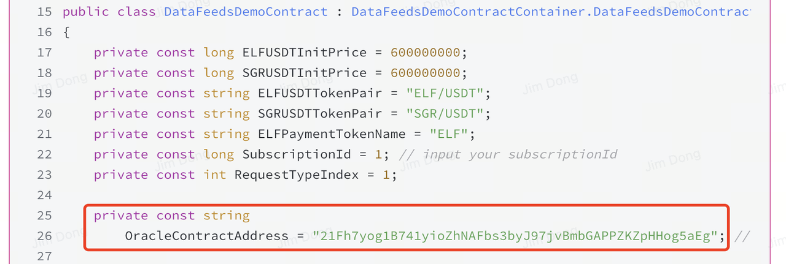

# Quick Start

## Requirements

This guide assumes that you have basic knowledge about writing and deploying smart contracts. If you are new to smart contract development, learn how to [Deploy Your First Smart Contract](/quick-start/developers/hello-world-contract/) before you begin.

## Preparation

### Apply Subscription ID

Before initiating a task to the oracle, you need to contact [AetherLink](https://t.me/TheAetherLink) to apply for a subscription number for your task. Later, you can manage the service fee based on this subscription ID. Remember that you only have the right to use your own subscription ID.

### Oracle Address

Below are the oracle contract addresses in different environments:

| ENV     | CHAINID | ADDRESS                                              |
| ------- | ------- | ---------------------------------------------------- |
| MainNet | AELF    | `BGhrBNTPcLccaxPv6hHJrn4CHHzeMovTsrkhFse5o2nwfvQyG`  |
| MainNet | tDVV    | `BGhrBNTPcLccaxPv6hHJrn4CHHzeMovTsrkhFse5o2nwfvQyG`  |
| TestNet | AELF    | `21Fh7yog1B741yioZhNAFbs3byJ97jvBmbGAPPZKZpHHog5aEg` |
| TestNet | tDVW    | `21Fh7yog1B741yioZhNAFbs3byJ97jvBmbGAPPZKZpHHog5aEg` |

How to use the oracle contract address. Please reference the picture below in the complete code. You can also dynamically configure it through other configurations.

## Next Steps

🚀 Congratulations on completing the preparations for integrating the oracle. We currently support 3 oracle scenarios, and you can navigate to the corresponding page based on your requirements.

1. **Datafeeds**: AetherLink Datafeeds provide decentralized, real-time data from multiple sources, enabling smart contracts to access highly reliable and accurate off-chain information, such as asset prices, for secure decision-making in decentralized applications.
2. **VRF (Verifiable Random Function)**: AetherLink VRF delivers provably fair and verifiable random numbers, ensuring the randomness used in smart contracts is tamper-proof and transparent. This is particularly useful for gaming, lotteries, and any application that requires trusted randomness.
3. **Automation**: AetherLink Automation allows developers to automate smart contract functions by triggering actions based on specific events or conditions. This reduces the need for manual intervention and ensures contracts execute efficiently and reliably when certain criteria are met.
