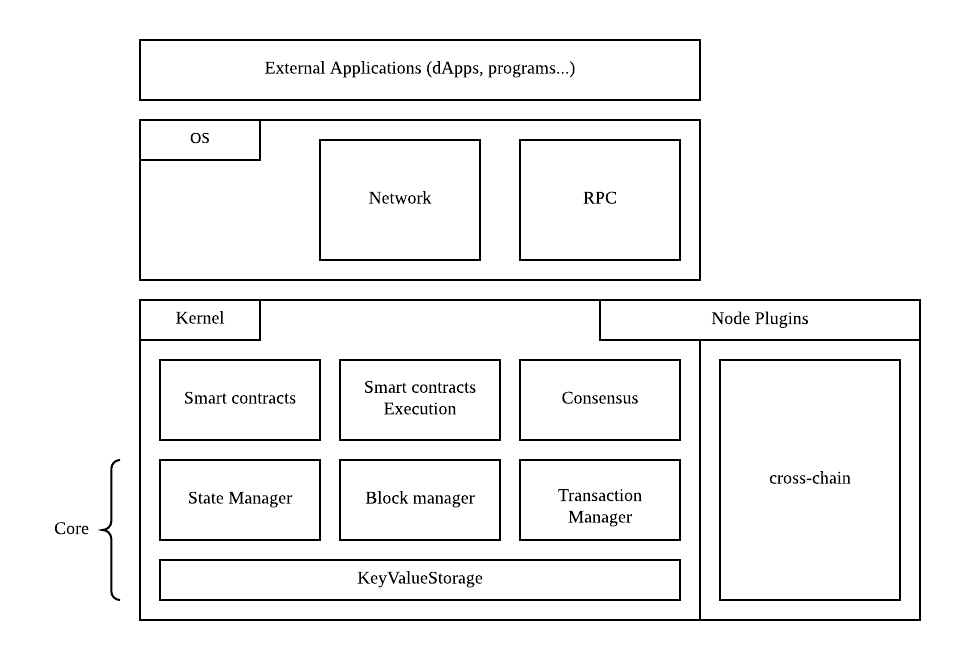

# Design Principles

The diagram above shows the conceptual structure of the node and the separation between the OS and Kernel.

## OS

The **OS layer** implements the application and infrastructure layers for the network. It also handles high-level network events and jobs, such as synchronizing the chain in response to a block announcement. Additionally, the OS layer includes the RPC implementation for the exposed API.

## Kernel

The **Kernel** contains smart contract execution primitives and definitions. It also defines the components necessary for accessing the blockchain's data. Various managers use the storage layer to access the underlying database.

The Kernel also introduces the concept of plugins. The diagram shows that side chain modules are implemented as plugins.

## Structure of the Project

To understand AElf's structure, this section provides an overview of the solution.

Conceptually, AElf is built on two main layers: **OS** and **Kernel**.

- **OS Layer:**
  - Contains high-level definitions for a node and endpoints like RPC and P2P.
- **Kernel Layer:**
  - Contains logic and definitions for smart contracts and consensus.

AElf has a native runtime for smart contracts implemented in **C#**, for contracts written in C#. This implementation is found in the **AElf.Runtime.CSharp.\*** projects.

A significant part of AElf is the side chain framework. It is mainly implemented in the **AElf.CrossChain** namespace, defining the main abstractions in the **core** project and an implementation with gRPC in the **AElf.Crosschain.Grpc** project.

The **AElf.Test** solution folder contains all the tests. Ensuring maximum coverage of the main functional aspects is crucial for maintaining the quality of our system.

Other projects implement libraries we use, like the crypto library, and others for infrastructure, like the database library. While not as critical, they are still worth exploring.

## Jobs and Event Handlers

Event handlers implement the logic that reacts to external and internal events. They represent the higher levels of the application, being called by the framework in a domain-agnostic manner. Event handlers, primarily using other services, influence the state of the chain.

## Modules

Our architecture is based on modules that are wired together at runtime. Any new module must inherit from **AElfModule**.

To implement a new module, follow these steps:

1. Write the event handler or the job.
2. Implement the interface and create a manager or infrastructure layer interface if needed.
3. Implement the infrastructure layer interface in the same project if no additional dependencies are required.
4. Implement the infrastructure layer interface in another project if it requires third-party dependencies (e.g., adding gRPC, MongoDB, or MySQL in the new project).

**Example:** The P2P network module.

The networking code is defined across two modules: **CoreOSAElfModule** and **GrpcNetworkModule**. The OS core defines and implements the application service (used by other components of the node) as it is part of the application/domain logic. The infrastructure layer (like the server endpoint) is defined in the OS core modules but implemented in another project that relies on a third party, such as gRPC.

## Testing

When writing a new component, event handler, or method, it is important for AElf's quality to consider the corresponding unit test. As previously mentioned, we have a solution-wide test folder where we place all the tests.
