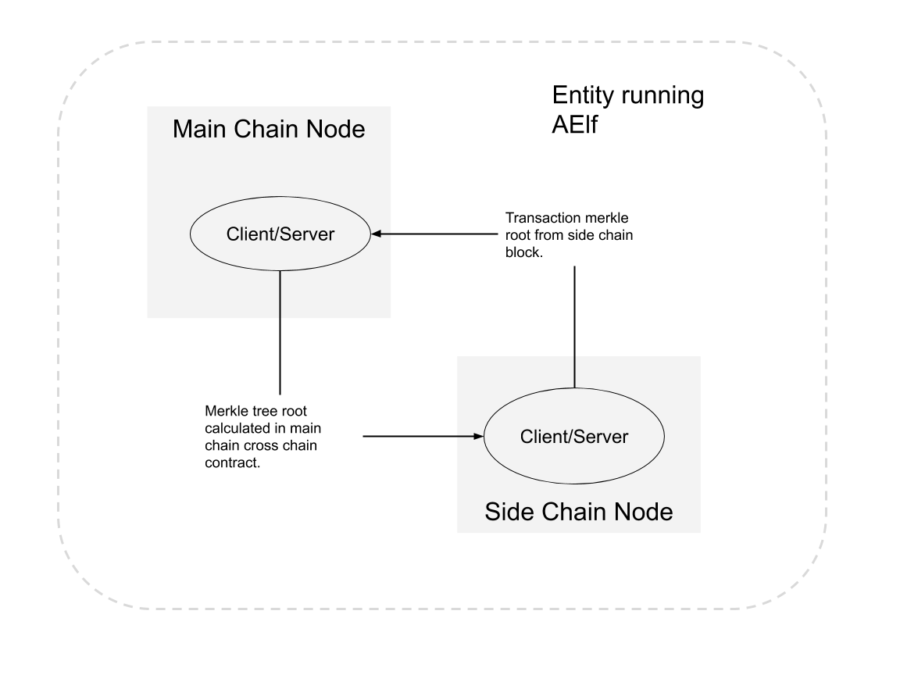

# Side Chain and Main Chain Node Documentation

## Overview

Conceptually, a side chain node and a main chain node are similar. Both are independent blockchains with their own peer-to-peer networks and possibly their own ecosystems. This setup can be implemented at multiple levels. In terms of peer-to-peer networks, all side chains operate in parallel to each other but are linked to a main chain node through a cross-chain communication mechanism.

Through this link, messages are exchanged, and indexing is performed to ensure that transactions from the main chain or other side chains are verifiable in the side chain. Implementers can use AElf libraries and frameworks to build these chains.

**Key Role of the Main Chain:**

- The main chain's primary purpose is to index the side chains.
- Only the main chain indexes data about all the side chains.
- Side chains are independent and do not have knowledge about each other.
- When side chains need to verify transactions from other chains, they use the main chain as a bridge to provide cross-chain verification information.

## Node Level Architecture

In the current architecture, both the side chain node and the main chain node have one server and exactly one client. This forms the basis for AElf's two-way communication between the main chain and side chains. Both the server and the client are implemented as node plugins (a node has a collection of plugins). Interaction (listening and requesting) can start once both nodes are running.



The diagram above illustrates two nodes run by an entity: one main chain node and one side chain node. Note that the nodes don't have to be in the same physical location.

### Side Chain Lifetime

The lifetime of a side chain involves the following steps:

- **Request side chain creation.**
- **Wait for acceptance on the main chain.**
- **Start and initialize the side chain.** It will be indexed by the main chain automatically.
- **Cross-chain verification** is allowed only if the side chain is indexed correctly.

### Communication

When the side chain node starts, it will initiate various communications. Here are the main points of the protocol:

- **Initial Request:** When the side chain node starts for the first time, it will request the main chain node for a chain initialization context.
- **Handshake:** After initialization, the side chain is launched and will perform a handshake with the main chain node to signal that it is ready to be indexed.
- **Indexing Process:** During indexing, information about irreversible blocks will be exchanged between the side chain and the main chain. The main chain will write the final result in a block, which is calculated using the cross-chain data from all side chains. The side chain will also record the data in a contract from the main chain.

AElf provides cross-chain communication implementation using gRPC.

```protobuf
rpc RequestIndexingFromParentChain (CrossChainRequest) returns (stream acs7.ParentChainBlockData) {}

rpc RequestIndexingFromSideChain (CrossChainRequest) returns (stream acs7.SideChainBlockData) {}
```

### Cache

For effective indexing, a cache layer is used to store cross-chain data received from remote nodes, ensuring the data is available and correct. The cross-chain data is cached by chain ID and block height with a count limit. The cache layer provides the data if it is cached when the node needs it, thus decoupling the communication part and node running logic.

### Cross-Chain Contract

Apart from the data in blocks, most cross-chain data will be stored by the cross-chain contract. Cross-chain data cached by the node is packed into transactions during the mining process, and the calculated result is stored by the contract. The cross-chain data in the block is the result of side chain indexing calculations from this contract. Cross-chain verification can only work correctly with data from this contract.

### Data Flow

Conceptually, the node operates as described in the following diagram. The main/side chain node receives cross-chain data from the other side and stores it in local memory. The indexing transaction is packed by the miner, and the cross-chain data is written into the `State` through the `Crosschain Contract`.


