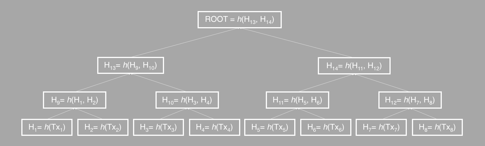
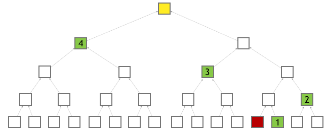

# Cross Chain Verification

Verification is the key feature that enables side chains. Because side chains do not have direct knowledge about other side chains, they need a way to verify information from other chains. Side chains need the ability to verify that a transaction was included in another side chain's block.

## Indexing

- The role of the main chain node is to index all the side chains' blocks.
  - This way, it knows exactly the current state of all the side chains.
  - Side chains also index main chain blocks, which is how they gain knowledge about the inclusion of transactions in other chains.
- Indexing is a continuous process:
  - The main chain permanently gathers information from the side chains.
  - The side chains permanently gather information from the main chain.
- When a side chain wants to verify a transaction from another side chain, it must wait until the correct main chain block has been indexed.

## Merkle Tree

- A Merkle tree is a basic binary tree structure.
  - For cross-chain in AElf, the leaf value is the hash from transaction data.
  - The node value (which is not a leaf node) is the hash calculated from its children's values up to the tree root.

## Merkle Root

- When a transaction is included in a side chain's block, the block will also include a Merkle root of the transactions in this block.
  - This root is local to this side chain's blockchain and, by itself, of little value to other side chains because they follow a different protocol.
  - Communication between side chains goes through the main chain in the form of a Merkle path.
  - During the indexing process, the main chain calculates the root with the data from side chains, and side chains in turn get the root in future indexing.
  - This root is used for the final check in cross-chain transaction verification.

## Merkle Path

- A Merkle path is the node collection for one leaf node to calculate to the root.
  - A correct Merkle path is necessary to complete any work related to cross-chain verification.
- For the transaction **tx** from chain **A**:
  - You need the whole Merkle path root for **tx** to calculate the final root if you want to verify the existence of this transaction on other chains.
  - Verify the root by checking whether it is equal to the one obtained from indexing before.

